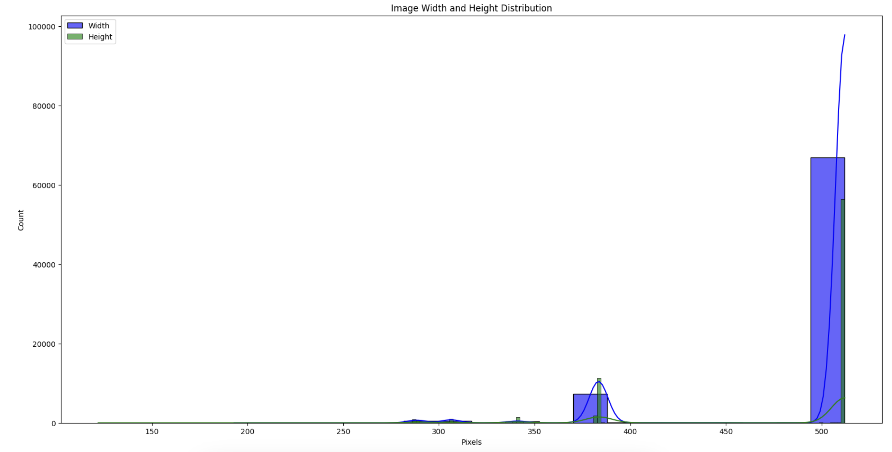
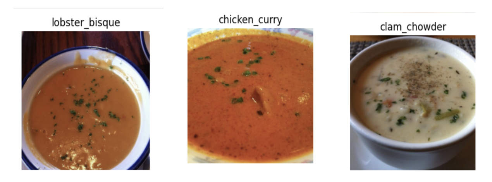
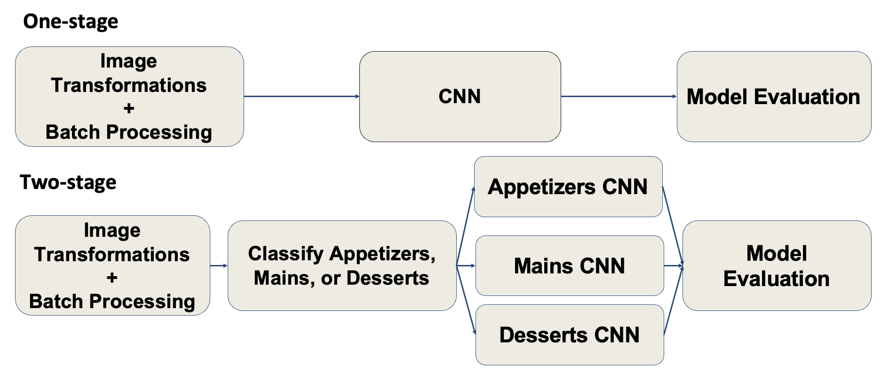
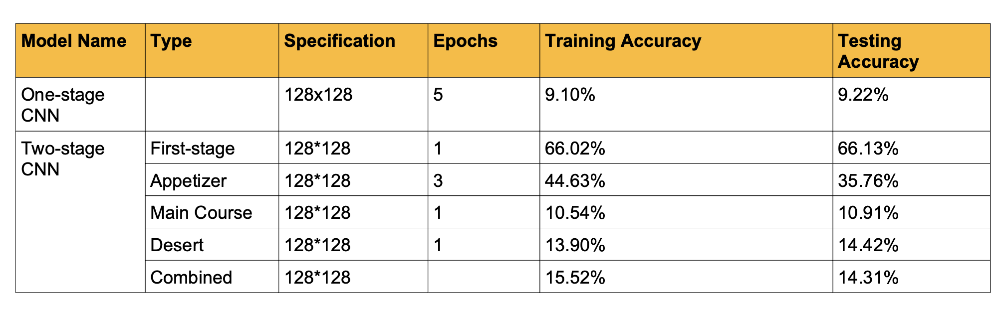
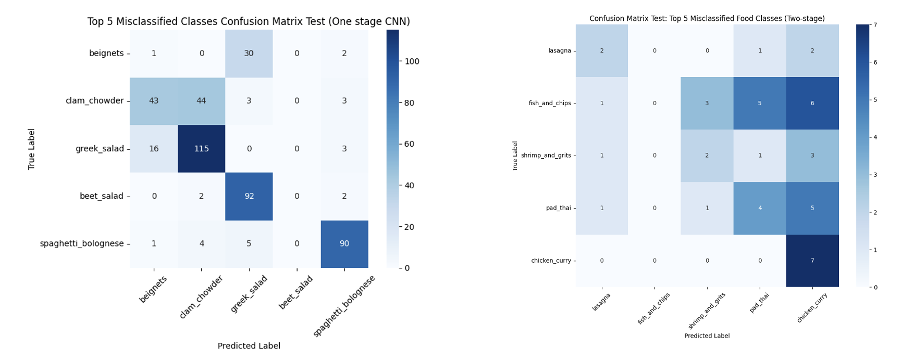
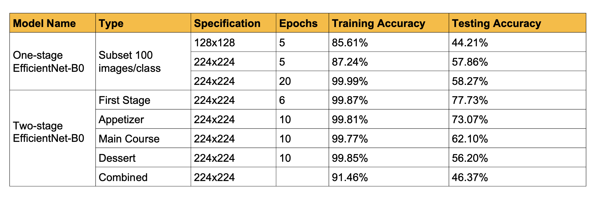
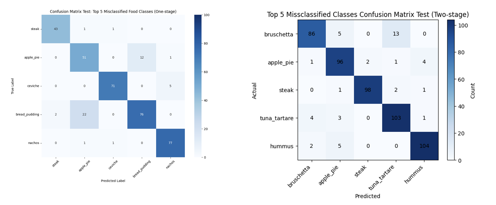

# Food Image Classification with CNN & EfficientNet

---

## Business Problem

As food services move to digital platforms, accurate food image recognition becomes critical for:

- Food delivery automation
- Smart menu systems
- Dietary tracking
- Cloud kitchens

Misclassification (e.g., *carbonara vs. bolognese*) leads to:

- Wrong orders  
- Refund costs  
- Customer dissatisfaction  

Our goal:  
> Build a high-accuracy food classification system using CNN-based deep learning.

---

## Dataset

**[Food-101](https://huggingface.co/datasets/ethz/food101)**

- 101 food categories  
- 101,000 images  
- 750 train / 250 test per class  
- Real-world noise & high visual similarity  

Challenges:

- High intra-class variation  
- High inter-class similarity  
- Variable image sizes  

---

## Exploratory Data Analysis

Key findings:

- Most images: `512×512`

- Strong visual overlap between categories (e.g., soups, salads)

- Can be classified into 3 categories:
  - Appetizer
  - Main Course
  - Dessert

---

## Methodology

We used two models: custom CNN and efficientNet-B0. For both models, we tried one-stage training and two-stage training.
The output will be one of the 101 original categories.

---

## Models

### 1️⃣ Custom CNN

#### One-stage
- Preprocessing: ensure 3 color channels, resize to 128 * 128 and normalize the pixel values to [-1,1]
- Architecture:
  - 2 Convolutional layers: 3->6->16 channels with ReLU and max pooling
  - 3 fully connected layers resulting in 101-class output

#### Two-stage (Hierarchical)
- Architecture:
  - 3 convolutional layers: 3 -> 32 -> 64 -> 128 channels with ReLU and max pooling (output: 128 * 16 * 16)
  - 3 fully connected layers: 128 * 16 * 16 -> 256 -> 27-class output(Appetizer)/47-class output(Main Course)/27-class output(Dessert)
  - Include dropout (p=0.5) after the first FC layer to reduce overfitting

---

### 2️⃣ Transfer Learning — EfficientNet-B0

Why EfficientNet-B0?

- Best speed–accuracy tradeoff
- Pretrained on ImageNet
- Compound scaling

Our setup:

- Replaced classification head → 101 classes
- Full fine-tuning (no frozen layers)

---

## Results

### Custom CNN

| Model | Performance |
|-------|------------|
One-stage | Severe misclassification |
Two-stage | More meaningful confusion patterns |

---

### EfficientNet-B0

| Model | Test Accuracy |
|-------|--------------|
One-stage | **58.27%** |
Two-stage | 46.37% |

Observations:

- One-stage > Two-stage
- Two-stage suffered from:
  - subclass imbalance
  - overfitting

---

## Key Insights

### Why transfer learning wins

Pretrained models already understand:

- edges
- textures
- shapes

Custom CNN must learn from scratch → data & compute insufficient.

---

### Why hierarchical failed for EfficientNet

Although theoretically strong:

- error propagation between stages
- small subclass sample size
- overfitting in fine-grained classifiers

---

## Limitations

- EfficientNet trained on subset (compute constraint)
- Models optimized independently
- Overfitting (train ≈ 99%, test 40–60%)

---

## Future Work

- Freeze early EfficientNet layers
- Class-balanced sampling
- Label smoothing
- Attention mechanisms
- Train all models on full dataset
- End-to-end hierarchical learning

---

## Takeaways

- Transfer learning is essential for fine-grained vision tasks  
- Hierarchical design helps error interpretability, but increases training complexity  

---

## References

- Food-101 (Bossard et al., 2014)
- DeepFood (2016)
- EfficientNet (Tan & Le, 2019)
- Transfer learning for food classification (Singh & Susan, 2023)
- Hierarchical food classification (Pan et al., 2023)

